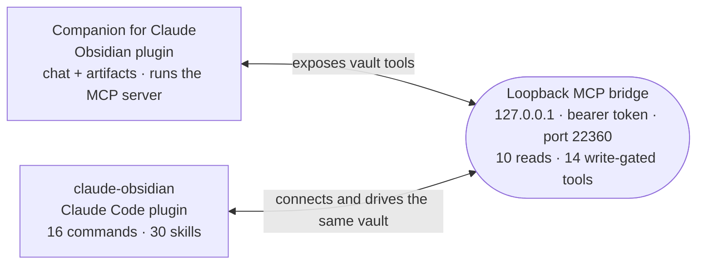

# claude-obsidian

**Cowork with Claude inside your [Obsidian](https://obsidian.md) vault.** Chat
with your notes as context, generate gallery-grade interactive HTML artifacts,
run extended-thinking sessions, and let Claude Code operate on the *same* vault —
all with your vault as the single source of truth.

[](https://github.com/cavi-ai/claude-obsidian/actions/workflows/obsidian-plugin-ci.yml)
[](https://obsidian.md/plugins?id=claude-companion)
[](LICENSE)

[**▶ Install the Obsidian plugin**](obsidian://show-plugin?id=claude-companion)
 · [**Add the Claude Code plugin**](#getting-it)
 · [Latest release](https://github.com/cavi-ai/companion-for-claude/releases/latest)

**Open source · MIT · bring your own Anthropic key · local-first**

Two paired, complementary deliverables that meet at a local MCP bridge:

| Path | What it is | Ships to |
|---|---|---|
| [`obsidian-plugin/`](obsidian-plugin/) | **Companion for Claude** — the Obsidian community plugin: side-panel chat with **agent mode** (Claude works your vault with its own tools), diff-reviewed note edits, vault-aware context with PDF/image attachments, link suggestions, consolidated memory, native Canvas/Bases generation, inline `claude-html` artifacts, prompt caching, offline local-model fallback, and a loopback MCP bridge. | Obsidian community store |
| [`claude-plugin/`](claude-plugin/) | **claude-obsidian** — the Claude Code plugin + marketplace: commands and skills that drive your vault over the Companion MCP bridge (synthesis, tagging, drafting, session capture, artifacts, spec builds, advisor roadmaps). | Claude Code marketplace |
| [`upstream/html-effectiveness/`](upstream/) | Thariq Shihipar's ["unreasonable effectiveness of HTML"](https://github.com/ThariqS/html-effectiveness) gallery, vendored as a **pinned, unmodified submodule** (its own Apache-2.0 license). See [`NOTICE`](NOTICE). | — |

---

## See it in action

| Chat with your vault | Interactive artifacts |
|---|---|
|  |  |

<!-- screenshots wanted: session-to-note.png, chat-controls.png — see assets/CAPTURE.md in the mirror repo -->

---

## Companion for Claude (the Obsidian plugin)

A full Claude chat experience that lives in your vault and speaks its language.

- **Agent mode** — Claude searches, reads, and follows links across your vault
  **on its own** while answering, each step visible as a tool chip. Optional
  write tools (create/edit/move notes) sit behind a per-action confirmation.
- **Edits as reviewable diffs** — "improve this note" produces a red/green
  per-hunk diff you accept or reject before anything is written.
- **Chat with vault context** — toggle `Context` chips to attach your active
  note, selection, linked/backlinked notes, or a keyword vault search to any
  message. **@-mention** notes, folders, **PDFs and images** — or paste a
  screenshot straight into the composer.
- **Second-brain loops** — live **link suggestions** (unlinked mentions, one
  click to wire up), and session digests consolidated into an evolving **"What
  Claude Knows"** memory note that agent mode reads back.
- **Native Canvas & Bases output** — Claude builds `.canvas` mind maps wired to
  real notes and `.base` database views over your frontmatter, write-gated like
  every other mutation.
- **Evidence-backed research, Phase 1** — a vault-native research workbench
  keeps sources, exact excerpts, review state, claims, and audit findings linked
  in readable Markdown, then produces an evidence-backed outline.
- **Prompt caching built in** — repeated context is cached server-side (reads at
  0.1× the input rate); the cost gauge accounts for it.
- **Three auth modes** — your Anthropic **API key** (default, community-store
  safe), a long-term **OAuth subscription token** (`claude setup-token`, usage
  bills to your plan), or **import from the environment**. Optional base-URL
  override for gateways.
- **In-chat controls** — switch model per message (Opus / Sonnet / Haiku),
  toggle **extended thinking** with an **effort** dial, stream the model's
  **reasoning** in a collapsible panel, and set per-message temperature / max
  tokens. Every control is model-aware: anything a model would reject is hidden,
  not broken.
- **Slash commands** — type `/` in the composer for a fuzzy palette:
  summarize, ask, improve, artifact, plan, canvas, workflows, capture, build,
  research, and more.
- **Interactive artifacts** — Claude emits a `claude-html` block;
  Companion renders it inline in a **sandboxed iframe** and can open it in your
  real browser or save it as a portable note.
- **Conversation history** — every chat persists across restarts; resume any
  past conversation from a fuzzy picker.
- **Never lose functionality** — an **Auto** chat backend transparently falls
  back to a local Ollama model when Claude is offline or out of usage, with a
  live connectivity indicator. Or run **Local only** for full offline use.
- **Unified bridge** — expose the vault as a loopback-only, token-gated MCP
  server so Claude Code / Claude Desktop work against the same notes.
- **Experimental, off by default** — **typed source capture** (enrich clipped
  files with typed frontmatter from per-type schemas) and a **vault ontology**
  (schema notes define note types + typed wikilink relations that Claude-created
  notes conform to).

→ Full details: [`obsidian-plugin/README.md`](obsidian-plugin/README.md)

### Evidence-backed research workflow (Phase 1)

Use `/research` in Companion to open the native Research Workbench. It shows
project state, evidence health, audits, and next actions without requiring a
model request. In Claude Code, use `/claude-obsidian:research-workbench` for the
skill-driven MCP workflow over the same canonical vault records.

The Phase 1 path is **Create project → Import source → Capture evidence →
Review → Build claims → Generate outline → Audit**. Source captures receive a
content fingerprint; evidence records preserve the exact excerpt, locator, and
captured fingerprint; claims keep supporting, challenging, and contextual
relations distinct. The research workbench presents the resulting canonical
Markdown records and their audit health.

Only **reviewed**, locatable, non-stale evidence linked to a valid source counts
as trusted claim support. Proposed evidence remains visible but does not satisfy
the audit. Phase 1 stops at an evidence-backed outline—it does not generate a
complete paper.

## claude-obsidian (the Claude Code plugin)

Commands and skills that let Claude Code operate on your vault through the
Companion MCP bridge — turning a chat agent into a vault collaborator. **16
commands and 30 skills** across seven areas, all built on a shared grounding
discipline (cite real notes, never fabricate, writes confirmed):

| Area | Commands / skills |
|---|---|
| **Knowledge** | `vault-synthesis` (grounded, cited "what do I know about X"), `connection-finder`, `source-digest`, `research-workbench` |
| **Hygiene** | `consistent-tagging`, `wikilink-weaver`, `moc-builder`, `frontmatter-normalizer`, `note-splitter`, `dedup-merge` |
| **Writing** | `outline-to-draft`, `daily-rollup`, `session-to-note`, `meeting-cleanup`, `summarize-and-link` |
| **Build** | `plan-to-spec`, `tracker-driver`, `build-retrospective`, `task-harvester` (plus the `build-from-spec` command) |
| **Cloud** | `cloud-reply` (dispatch a cloud session; result lands as a reply note + PR for vault import) |
| **Advisor personas (`manifest-*`)** | `vault`, `pm`, `infra`, `feature`, `content`, `risk`, `research`: survey the vault, produce a prioritized `claude-html` artifact, and route work into the build pipeline |
| **Foundations** | `vault-grounding`, `vault-routines` (offer editable scheduled routines), and the `note-to-artifact` design system |

Headline command: `/claude-obsidian:session-to-note` distills a whole Claude
session into one consolidated, tagged, linked vault note — turning ephemeral
session memory into persistent knowledge-graph points.

→ Full details (all commands + skills): [`claude-plugin/README.md`](claude-plugin/README.md)

---

## How the two fit together



**Vault tools exposed over the bridge** — 10 reads/audits (always):
`vault_search`, `note_read`, `list_recent`, `vault_tags`, `list_titles`,
`get_backlinks`, `get_outgoing_links`, `frontmatter_query`,
`research_project_read`, `research_audit`; 14 mutations (gated behind *Allow
MCP writes*): `note_create`, `note_append`, `note_update`,
`update_frontmatter`, `note_move` (rename/move with automatic backlink
rewrite), `base_create`, `canvas_create`, `research_project_create`,
`research_source_import`, `research_evidence_capture`,
`research_evidence_review`, `research_claim_create`, `research_claim_link`,
`research_outline_generate`.

Research Workbench project reads and audits are therefore available even when
writes are disabled. Project, source, evidence, evidence-review, claim, link,
and outline mutations require *Allow MCP writes*; in Companion agent mode they
also retain the normal confirmation gate. Review mutates evidence records only,
and accepts the terminal states `reviewed` or `rejected`. Permanent legacy
aliases remain callable for compatibility but are intentionally omitted from
the advertised command catalog.

Companion runs a local MCP server (`obsidian-vault`, bound to `127.0.0.1`,
bearer-token auth, default port **22360**). The Claude Code plugin connects to
it — so Claude Code and the in-vault chat operate on the **same** notes. The
compliant way to unify them without subscription OAuth in third-party tools.

## Getting it

**Install the Obsidian plugin (Companion for Claude)** — *Settings → Community
plugins → Browse → search "Companion for Claude" → Install → Enable*, or
[open it in Obsidian](obsidian://show-plugin?id=claude-companion).

**Install the Claude Code plugin** —
`/plugin marketplace add cavi-ai/claude-obsidian` then
`/plugin install claude-obsidian@claude-obsidian`.

<details><summary>Build from source (development)</summary>

```bash
git clone --recurse-submodules https://github.com/cavi-ai/claude-obsidian.git
# already cloned without submodules?
git submodule update --init --recursive
```

See [`obsidian-plugin/README.md`](obsidian-plugin/README.md) for plugin dev/build steps.
</details>

## Open-source hygiene

- [`CONTRIBUTING.md`](CONTRIBUTING.md) — local development, release versioning,
  security-sensitive review rules.
- [`SECURITY.md`](SECURITY.md) — supported versions, vulnerability reporting,
  security boundaries.
- [`CODE_OF_CONDUCT.md`](CODE_OF_CONDUCT.md) — contributor standard.

## Provenance

The artifact design system is an **original reformulation** of the aesthetic in
Thariq Shihipar's gallery — not a copy of his HTML. The gallery itself is
vendored only as a pinned, unmodified submodule. Full attribution is in
[`NOTICE`](NOTICE); everything we authored is MIT-licensed ([`LICENSE`](LICENSE)).

## License

MIT — see [`LICENSE`](LICENSE). The vendored `upstream/html-effectiveness`
submodule is under its own Apache-2.0 license.
