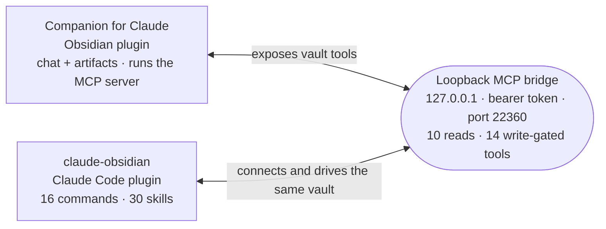

# claude-obsidian

**Cowork with Claude inside your [Obsidian](https://obsidian.md) vault.** Chat
with your notes as context, let Claude work the vault with its own tools, render
interactive artifacts inline, and drive the *same* vault from Claude Code.

[](https://github.com/cavi-ai/claude-obsidian/actions/workflows/obsidian-plugin-ci.yml)
[](https://obsidian.md/plugins?id=claude-companion)
[](LICENSE)

[**▶ Install the Obsidian plugin**](obsidian://show-plugin?id=claude-companion)
 · [**Add the Claude Code plugin**](#getting-it)
 · [Latest release](https://github.com/cavi-ai/companion-for-claude/releases/latest)

**Open source · MIT · bring your own Anthropic key · local-first**

<!-- hero: assets/hero-session-to-note.gif — pending capture, see assets/CAPTURE.md -->

| Chat with your vault | Interactive artifacts |
|---|---|
|  |  |

---

## Why cowork with Claude inside your vault

An AI second brain only works if the AI can actually reach the brain. Copying
notes into a chat window loses the links, the structure, and the history that
make a vault worth keeping. Companion puts Claude *in* Obsidian: your notes are
the context, your notes are the memory, and your notes are where the work lands.

What makes this pairing different is that Claude doesn't just read a snippet you
pasted — it searches and follows links across the live vault on its own, writes
back only through diffs you approve, renders interactive artifacts inside your
notes, and exposes the same vault to Claude Code so terminal work and vault work
share one source of truth.

## Who this is for

- **New to Obsidian + AI** — install from the community store, paste one API key, and start asking questions about your own notes. No account with us, no subscription to us.
- **Obsidian power user** — a real agent loop with visible tool calls, per-hunk diff review, native Canvas/Bases output, typed sources and vault ontology, an evidence-backed research desk, and local-model fallback. All MIT.
- **Claude Code developer** — a loopback, token-gated MCP server over your live vault, plus a Claude Code plugin of commands and skills that drive it. Your session memory becomes vault knowledge.

## What it does

### Claude works your vault, not a copy of it

Agent mode lets Claude search, read, and follow links across the vault **on its
own** while it answers, each step visible as a tool chip. Write tools sit behind
a per-action confirmation you control.

<!-- screenshot: assets/agent-tool-chips.png — pending capture -->

### Edits arrive as diffs, not overwrites

"Improve this note" produces a red/green **per-hunk** diff you accept or reject
before anything touches disk. Same for inline rewrites: select text →
*Rewrite selection with Claude…* — no chat round-trip.

<!-- screenshot: assets/diff-review.png — pending capture -->

### Interactive artifacts, rendered in the note

Claude emits a `claude-html` block; Companion renders it inline in a **sandboxed
iframe** that cannot reach your vault, network, or cookies. Open it in your real
browser or save it as a portable note.


### Research you can defend

The Research Desk keeps one active project moving: sources → evidence → claims →
outline → draft → assurance. Only reviewed, locatable, non-stale evidence counts
as support, and revisions are validated so citations can't silently vanish.

<!-- screenshot: assets/research-desk.png — pending capture -->

### The same vault from Claude Code

Companion runs a loopback-only, token-gated MCP server. Claude Code connects to
it and operates on the notes you're looking at — 16 commands and 30 skills for
synthesis, tagging, session capture, spec builds, and advisor roadmaps.

<!-- screenshot: assets/mcp-bridge-settings.png — pending capture -->

### It keeps working offline

The **Auto** chat backend falls back to a local Ollama model when Claude is
offline or out of usage, with a live connectivity indicator. Or run **Local
only**. Semantic search runs on a built-in on-device embedding model — no
external runtime required, desktop and mobile.

<!-- screenshot: assets/local-fallback-indicator.png — pending capture -->

## How it compares

<!-- facts retrieved 2026-07-26; re-verify before republishing -->

| | Agent mode | Per-hunk diff review | In-note interactive artifacts | MCP server for Claude Code | Local-model fallback | Research workflow | Price & license |
|---|---|---|---|---|---|---|---|
| **Companion for Claude** | Yes, free | Yes | Yes, sandboxed | Yes | Yes — automatic Auto fallback + on-device embeddings | Yes — sources/evidence/claims | Free · MIT · BYO key |
| Copilot for Obsidian | Yes — **Plus only** | One-click apply | Not documented | Not documented | Any OpenAI-compatible or local model | Not documented | Free tier · Plus $14.99/mo or $139.99/yr · AGPL-3.0 |
| Smart Connections | Not documented | n/a — retrieval, not editing | Not documented | Not documented | Local embeddings built in; chat models via Pro | Not documented | Free core · Pro tier · Smart Plugins License (source-available) |
| Smart Composer | Not documented (MCP **client**) | One-click apply | Not documented | Client only, not a server | Ollama, LM Studio | Not documented | Free · MIT · BYO key |
| Text Generator | Not documented | Not documented | Not documented | No | Ollama | Not documented | Free · MIT · BYO key |

Each of these is good at something we're not: **Copilot** has the largest install
base and the broadest model and file-format support; **Smart Connections**
pioneered local-embedding related-notes in Obsidian and still needs no API key;
**Smart Composer** has the cleanest apply-edit UX and the longest provider list,
free and MIT; **Text Generator** has the best reusable prompt-template engine and
a community template library. Different philosophy, not a worse tool — we
optimize for the vault as source of truth, safety-gated writes, and Claude-native
depth over provider breadth.

## Quick start

1. **Install** — *Settings → Community plugins → Browse → "Companion for Claude" → Install → Enable*, or [open it in Obsidian](obsidian://show-plugin?id=claude-companion).
2. **Add your key** — get one from the [Anthropic Console](https://console.anthropic.com/settings/keys), then paste it in *Settings → Companion for Claude → Connection → Anthropic API key* and click **Save & test connection**.
3. **Ask something** — open the Companion panel, toggle the `Context` chip for your active note, and ask a question about it.

<!-- Guides section — completed in Phase 2 -->

---

## The two halves

| Path | What it is | Ships to |
|---|---|---|
| [`obsidian-plugin/`](obsidian-plugin/) | **Companion for Claude** — the Obsidian community plugin: chat with agent mode, diff-reviewed edits, vault context with PDF/image attachments, link suggestions, consolidated memory, native Canvas/Bases output, inline `claude-html` artifacts, prompt caching, local-model fallback, and the MCP bridge. | Obsidian community store |
| [`claude-plugin/`](https://github.com/cavi-ai/claude-obsidian-plugin) | **claude-obsidian** — the Claude Code plugin + marketplace: 16 commands and 30 skills that drive your vault over the Companion MCP bridge. Pinned submodule; see its [README](https://github.com/cavi-ai/claude-obsidian-plugin#readme). | Claude Code marketplace |
| [`upstream/html-effectiveness/`](upstream/) | Thariq Shihipar's ["unreasonable effectiveness of HTML"](https://github.com/ThariqS/html-effectiveness) gallery, vendored as a **pinned, unmodified submodule** (its own Apache-2.0 license). See [`NOTICE`](NOTICE). | — |
| [`upstream/obsidian-skills/`](upstream/) | Steph Ango's (@kepano, Obsidian CEO) [Obsidian Skills](https://github.com/kepano/obsidian-skills), vendored the same way (its own MIT license) and used as the canonical format reference for our Bases, Canvas, and Obsidian-Flavored-Markdown emitters. See [`NOTICE`](NOTICE). | — |


```mermaid
flowchart LR
    companion["Companion for Claude<br/>Obsidian plugin<br/>chat + artifacts · runs the MCP server"]
    bridge(["Loopback MCP bridge<br/>127.0.0.1 · bearer token · port 22360<br/>10 reads · 14 write-gated tools"])
    code["claude-obsidian<br/>Claude Code plugin<br/>16 commands · 30 skills"]

    companion <-->|"exposes vault tools"| bridge
    code <-->|"connects and drives the same vault"| bridge
```

Ten read/audit tools are always available; fourteen mutations sit behind *Allow
writes*, so project reads and audits work even when writing is off. In agent
mode, writes keep their normal per-action confirmation on top.

## Getting it

**Install the Obsidian plugin (Companion for Claude)** — *Settings → Community
plugins → Browse → search "Companion for Claude" → Install → Enable*, or
[open it in Obsidian](obsidian://show-plugin?id=claude-companion).

**Install the Claude Code plugin** —
`/plugin marketplace add cavi-ai/claude-obsidian` then
`/plugin install claude-obsidian@claude-obsidian`.

<details><summary>Build from source (development)</summary>

```bash
git clone --recurse-submodules https://github.com/cavi-ai/claude-obsidian.git
# already cloned without submodules?
git submodule update --init --recursive
```

See [`obsidian-plugin/README.md`](obsidian-plugin/README.md) for plugin dev/build steps.
</details>

## Open-source hygiene

- [`CONTRIBUTING.md`](CONTRIBUTING.md) — local development, release versioning,
  security-sensitive review rules.
- [`SECURITY.md`](SECURITY.md) — supported versions, vulnerability reporting,
  security boundaries.
- [`CODE_OF_CONDUCT.md`](CODE_OF_CONDUCT.md) — contributor standard.

## Provenance

The artifact design system is an **original reformulation** of the aesthetic in
Thariq Shihipar's gallery — not a copy of his HTML. The gallery itself is
vendored only as a pinned, unmodified submodule.

Steph Ango's (@kepano) [Obsidian Skills](https://github.com/kepano/obsidian-skills)
are vendored the same way at `upstream/obsidian-skills/` and serve as the
canonical format reference for our `.base`, `.canvas`, and Obsidian-flavored
Markdown generation. His skills work on vault *files* (including via
`obsidian-cli`); the Companion MCP bridge works on the *live, running* vault —
the two are complementary, and we recommend installing both. Web-source capture
uses his [Defuddle](https://github.com/kepano/defuddle) library (MIT), the same
extraction engine behind the official Obsidian Web Clipper.

Full attribution is in [`NOTICE`](NOTICE); everything we authored is
MIT-licensed ([`LICENSE`](LICENSE)).

## License

MIT — see [`LICENSE`](LICENSE). The vendored `upstream/html-effectiveness`
submodule is under its own Apache-2.0 license.
