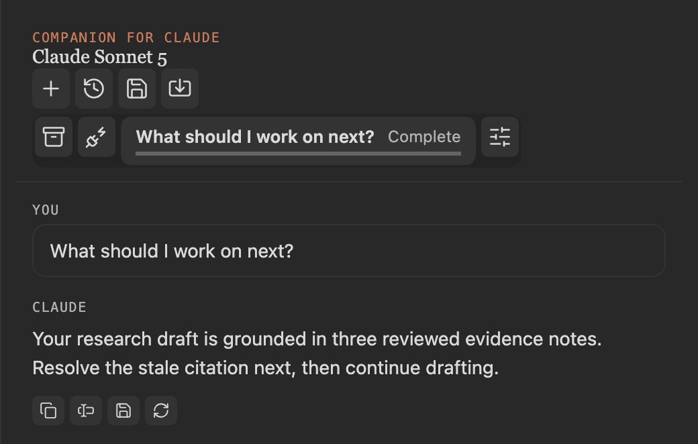
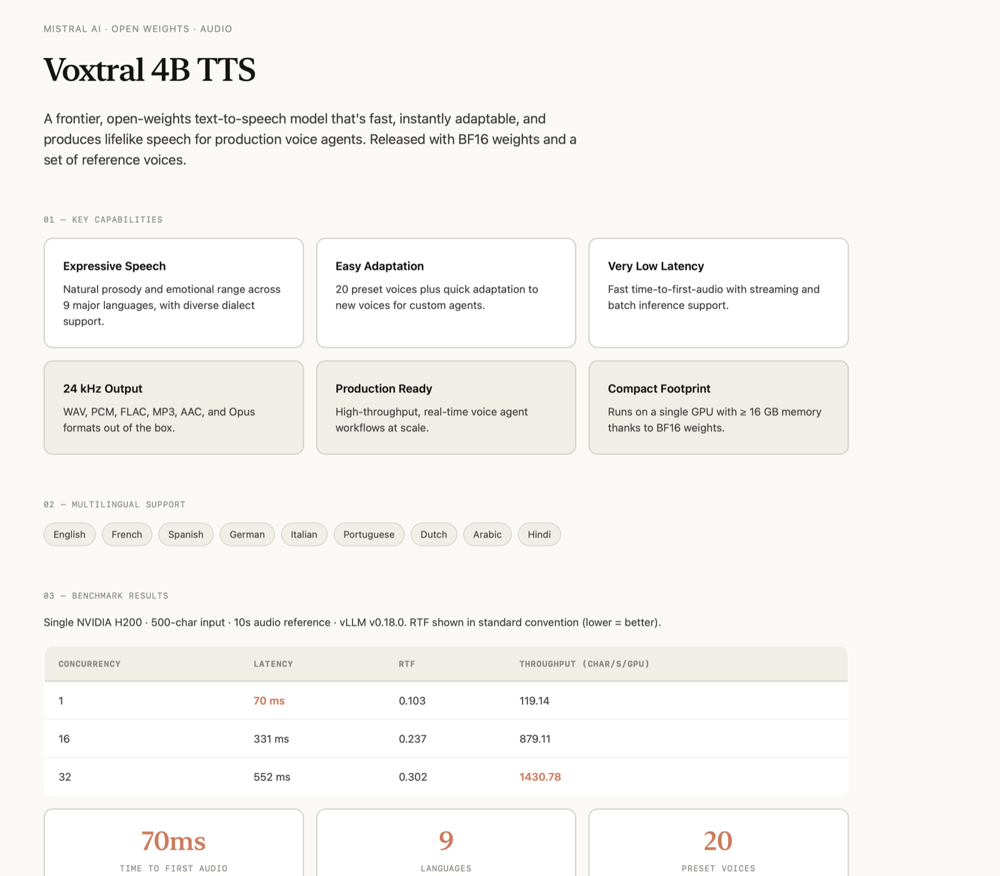
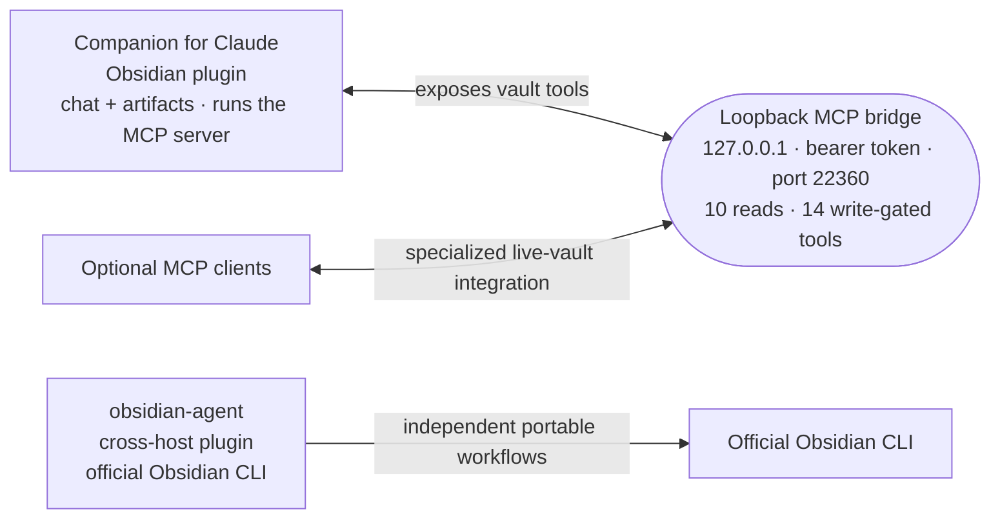

# claude-obsidian

**Cowork with Claude inside your [Obsidian](https://obsidian.md) vault.** Chat
with your notes as context, let Claude work the vault with its own tools, render
interactive artifacts inline, and drive the *same* vault from Claude Code.

[](https://github.com/cavi-ai/claude-obsidian/actions/workflows/obsidian-plugin-ci.yml)
[](https://obsidian.md/plugins?id=claude-companion)
[](LICENSE)

[**▶ Install the Obsidian plugin**](obsidian://show-plugin?id=claude-companion)
 · [**Add portable agent workflows**](#getting-it)
 · [Latest release](https://github.com/cavi-ai/companion-for-claude/releases/latest)

**Open source · MIT · bring your own Anthropic key · local-first**

<!-- hero: assets/hero-daily-rollup.gif — pending capture, see assets/CAPTURE.md -->

| Chat with your vault | Interactive artifacts |
|---|---|
|  |  |

---

## What it does

### Agent mode

Claude searches, reads, and follows links across the vault while answering, each
step shown as a tool chip. Write tools require per-action confirmation. The same
agent runs **fully local** on a tool-capable Ollama model (llama3.1, qwen3) —
the composer tells you when the selected model lacks tool support. Optional
**web search & fetch** tools and **external MCP servers** extend the agent past
the vault, both off by default and per-call confirmed.
→ [agent-mode.md](guides/agent-mode.md)

<!-- screenshot: assets/agent-tool-chips.png — pending capture -->

### Diff-reviewed edits

Note edits render as a per-hunk red/green diff; only accepted hunks are written.
Inline rewrites use the same review path: select text → *Rewrite selection with
Claude…*. Plan Mode restricts a turn to read-only tools and ends in a proposed
plan.
→ [agent-mode.md](guides/agent-mode.md#editing-notes-diffs-not-writes)

<!-- screenshot: assets/diff-review.png — pending capture -->

### Interactive artifacts

Claude emits a `claude-html` block; Companion renders it inline in a sandboxed
iframe with no vault, network, or cookie access. Open it in a browser or save it
as a note. → [artifacts.md](guides/artifacts.md)


### Research Desk and Workbench

Sources → evidence → claims → outline → draft → assurance, stored as Markdown
notes. Only reviewed, locatable, non-stale evidence counts as claim support.
Draft revisions are validated before preview and reject unsupported citations.
→ [research-workbench.md](guides/research-workbench.md)

<!-- screenshot: assets/research-desk.png — pending capture -->

### Optional MCP bridge

Companion runs a loopback-only, token-gated MCP server over the live vault. The
bridge is a specialized integration for explicitly configured MCP clients; it
is separate from the CLI-only `obsidian-agent` plugin. The client direction
works too: the agent can consume **external MCP servers** (HTTP or stdio) from
chat, each call confirmed — Companion is the two-way hub.
→ [claude-code-bridge.md](guides/claude-code-bridge.md)

<!-- screenshot: assets/mcp-bridge-settings.png — pending capture -->

### Sources, clippings & research import

A watched clippings inbox auto-enriches new clips with typed frontmatter
(title, tags, summary — works on a thinking-free local utility call, so bulk
ingest stays cheap and reliable) without replacing the clip body or existing
metadata. After enrichment, **Review all links** collects every suggested
wikilink into one Git-style review: a collapsed accordion per note, with
note-level and per-hunk selection before the accepted set is written. The
**Organize clippings** command takes the existing pile: meaningful renames,
tags, and an LLM-inferred domain/project folder per clip, shown as a reviewable
move plan before anything is filed. Research sources import from web, PDF, DOI,
arXiv, **Zotero**, or the vault.
→ [research-workbench.md](guides/research-workbench.md)

### Local models

The Auto chat backend falls back to a local Ollama model when Claude is offline
or out of usage; Local only runs every request on Ollama — **including the
agent**, on models whose metadata reports tool support. Settings badge every
detected model with its tools/thinking capabilities, and a composer indicator
shows when the current backend reasons before answering. Semantic search uses a
built-in on-device embedding model on desktop and mobile — and also indexes
**vault PDFs**, keeping page locators in every result.
→ [local-models.md](guides/local-models.md)

<!-- screenshot: assets/local-fallback-indicator.png — pending capture -->

## Quick start

1. **Install** — *Settings → Community plugins → Browse → "Companion for Claude" → Install → Enable*, or [open it in Obsidian](obsidian://show-plugin?id=claude-companion).
2. **Add your key** — get one from the [Anthropic Console](https://console.anthropic.com/settings/keys), then paste it in *Settings → Companion for Claude → Connection → Anthropic API key* and click **Save & test connection**.
3. **Ask something** — open the Companion panel, toggle the `Context` chip for your active note, and ask a question about it.

## Guides

- [Getting started](guides/getting-started.md) — install, key, first chat, first artifact
- [Agent mode](guides/agent-mode.md) — the tool loop, the tools, the guardrails
- [Artifacts](guides/artifacts.md) — `claude-html` blocks and the sandbox model
- [Research Desk & Workbench](guides/research-workbench.md) — evidence-backed writing end to end
- [The Claude Code bridge](guides/claude-code-bridge.md) — MCP setup and full tool reference
- [Local models & semantic search](guides/local-models.md) — Ollama fallback and on-device embeddings
- [Authentication & cost](guides/auth.md) — three credential modes, caching, key safety
- [Architecture](guides/architecture.md) — module map, testability, bundling, security
- [FAQ](guides/faq.md) — cost, privacy, mobile, troubleshooting

---

## Products and integrations

| Path | What it is | Ships to |
|---|---|---|
| [`obsidian-plugin/`](obsidian-plugin/) | **Companion for Claude** — the Obsidian community plugin: chat with agent mode, diff-reviewed edits, vault context with PDF/image attachments, link suggestions, consolidated memory, native Canvas/Bases output, inline `claude-html` artifacts, prompt caching, local-model fallback, and the MCP bridge. | Obsidian community store |
| [`claude-plugin/`](https://github.com/cavi-ai/obsidian-agent) | **obsidian-agent** — universal workflows for Claude, Codex, Gemini, OpenCode, and AgentSkills hosts over the official Obsidian CLI. It has no Companion or MCP dependency. The compatibility-named path is a pinned submodule; see its [README](https://github.com/cavi-ai/obsidian-agent#readme). | [`cavi-ai/plugins`](https://github.com/cavi-ai/plugins) and native host packages |
| [`upstream/html-effectiveness/`](upstream/) | Thariq Shihipar's ["unreasonable effectiveness of HTML"](https://github.com/ThariqS/html-effectiveness) gallery, vendored as a **pinned, unmodified submodule** (its own Apache-2.0 license). See [`NOTICE`](NOTICE). | — |
| [`upstream/obsidian-skills/`](upstream/) | Steph Ango's (@kepano) [Obsidian Skills](https://github.com/kepano/obsidian-skills), vendored the same way (its own MIT license) and used as the format reference for the Bases, Canvas, and Obsidian-Flavored-Markdown emitters. See [`NOTICE`](NOTICE). | — |


```mermaid
flowchart LR
    companion["Companion for Claude<br/>Obsidian plugin<br/>chat + artifacts · runs the MCP server"]
    bridge(["Loopback MCP bridge<br/>127.0.0.1 · bearer token · port 22360<br/>10 reads · 14 write-gated tools"])
    agent["obsidian-agent<br/>cross-host plugin<br/>official Obsidian CLI"]
    client["Optional MCP clients"]

    companion <-->|"exposes vault tools"| bridge
    client <-->|"specialized live-vault integration"| bridge
    agent -->|"independent portable workflows"| cli["Official Obsidian CLI"]
```

Ten read/audit tools are always available. Fourteen mutations require *Allow
writes*. Optional **web_search** and **web_fetch** join the read set when
enabled. In agent mode, writes also keep their per-action confirmation.

## Getting it

**Install the Obsidian plugin (Companion for Claude)** — *Settings → Community
plugins → Browse → search "Companion for Claude" → Install → Enable*, or
[open it in Obsidian](obsidian://show-plugin?id=claude-companion).

**Install the universal Obsidian agent plugin for Claude Code** — enable the
official CLI in Obsidian 1.12.7 or newer, then run:

```text
/plugin marketplace add cavi-ai/plugins
/plugin install obsidian-agent@cavi-ai
```

The universal plugin works without Companion and without MCP. Install Companion
separately when you want its in-Obsidian chat, artifacts, local models, or
optional live-vault MCP bridge.

<details><summary>Build from source (development)</summary>

```bash
git clone --recurse-submodules https://github.com/cavi-ai/claude-obsidian.git
# already cloned without submodules?
git submodule update --init --recursive
```

See [`obsidian-plugin/README.md`](obsidian-plugin/README.md) for plugin dev/build steps.
</details>

## Open-source hygiene

- [`CONTRIBUTING.md`](CONTRIBUTING.md) — local development, release versioning,
  security-sensitive review rules.
- [`SECURITY.md`](SECURITY.md) — supported versions, vulnerability reporting,
  security boundaries.
- [`CODE_OF_CONDUCT.md`](CODE_OF_CONDUCT.md) — contributor standard.

## Provenance

The artifact design system is an original reformulation of the aesthetic in
Thariq Shihipar's gallery, not a copy of his HTML. The gallery is vendored as a
pinned, unmodified submodule.

Steph Ango's (@kepano) [Obsidian Skills](https://github.com/kepano/obsidian-skills)
are vendored the same way at `upstream/obsidian-skills/` and serve as the format
reference for `.base`, `.canvas`, and Obsidian-flavored Markdown generation. His
skills operate on vault files; the Companion MCP bridge operates on the running
vault. Web-source capture uses his [Defuddle](https://github.com/kepano/defuddle)
library (MIT), the extraction engine behind the Obsidian Web Clipper.

Full attribution is in [`NOTICE`](NOTICE). Everything authored here is
MIT-licensed ([`LICENSE`](LICENSE)).

## License

MIT — see [`LICENSE`](LICENSE). The vendored `upstream/html-effectiveness`
submodule is under its own Apache-2.0 license.
