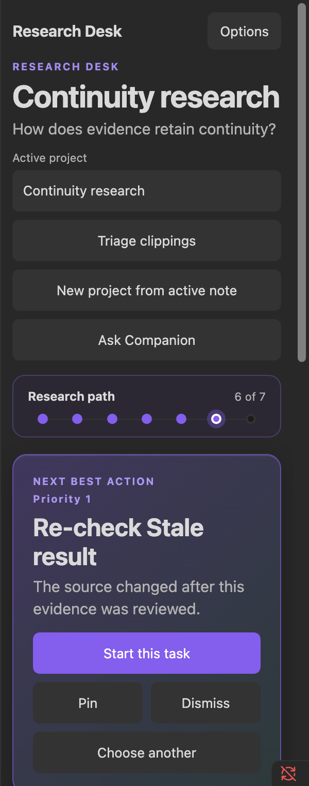

# Companion for Claude

**Cowork with Claude inside your Obsidian vault.** Your notes stay the context,
memory, and output while Claude searches, reasons, drafts, and helps you move
work forward.

[](https://github.com/cavi-ai/claude-obsidian/actions/workflows/obsidian-plugin-ci.yml)
[](https://obsidian.md/plugins?id=claude-companion)
[](LICENSE)

[**Install Companion for Claude**](https://obsidian.md/plugins?id=claude-companion)
· [Quick start](#quick-start)
· [Read the guides](#guides)


## Quick start

1. In Obsidian, open **Settings → Community plugins → Browse**, search for
   **Companion for Claude**, then install and enable it.
2. Open Companion and choose how Claude runs: your signed-in Claude Code CLI on
   desktop, an Anthropic API key on any device, or a local model.
3. Open a note, turn on the **Note** context chip, and ask Claude what to work on
   next.

[Full setup guide →](guides/getting-started.md)

## One vault. One continuous workflow.

Companion is built for work that develops across many notes and many sessions.
It keeps the live vault at the center instead of copying your knowledge into a
separate chat product.

### Understand the vault

Chat with the active note, a selection, linked notes, folders, PDFs, images, or
the whole vault. In agent mode, Claude can search, read, and follow links as it
works; every tool step stays visible. Keyword and on-device semantic search make
the same material discoverable without sending an embedding index away.

[Explore context and agent mode →](guides/agent-mode.md)

### Research and write with continuity

The Research Desk carries a project from sources to evidence, claims, outline,
draft, and assurance. Evidence keeps its source locator and fingerprint, and
only reviewed, current evidence counts as trusted support. The vault remains
the readable source of truth at every stage.

<p align="center">
  
</p>

[See the research workflow →](guides/research-workbench.md)

### Review before Claude changes anything

Claude can propose edits, create notes, build native Canvas and Bases files, or
hand a plan to Claude Code. Writes stay behind confirmation, and note edits are
presented as reviewable hunks so you choose exactly what lands. If the app
closes during a turn, the saved conversation restores the interrupted work as
stopped with a **Retry** action.

[Learn about edits and guardrails →](guides/agent-mode.md#editing-notes-diffs-not-writes)

## Choose how Claude runs

- **Claude Code sign-in** — desktop chat through the installed, signed-in
  `claude` command; no API credential stored by Companion.
- **Anthropic API** — direct streaming chat on desktop and mobile with your API
  key, long-term OAuth token, or environment credential.
- **Local models** — Ollama or an OpenAI-compatible endpoint for chat and
  utility work. Tool-capable Ollama models can run the vault agent locally.
- **Auto** — start with Claude and fall back to a reachable local model when
  Claude is offline, rate-limited, or unavailable.

[Authentication and cost →](guides/auth.md) ·
[Local models and on-device search →](guides/local-models.md)

## Built for control

- **Reviewable by default.** Agent writes require confirmation; diff-based edits
  require explicit hunk acceptance.
- **Local-first where it matters.** Semantic embeddings run on device. The
  optional MCP bridge binds to `127.0.0.1`, requires a bearer token, and keeps
  writes disabled until you enable them.
- **Your vault remains yours.** Research records, artifacts, Canvas files,
  Bases, and generated notes are ordinary vault files. Conversations persist
  across restarts without becoming a separate knowledge store.
- **Extensible without being tangled.** Companion can expose live-vault tools
  through its optional MCP bridge and consume explicitly configured external
  MCP servers from agent mode.

[Privacy and data flow →](obsidian-plugin/README.md#what-leaves-your-machine) ·
[MCP bridge security and setup →](guides/claude-code-bridge.md)

## Companion and portable workflows

This repository contains two related products with separate jobs:

- [`obsidian-plugin/`](obsidian-plugin/) is **Companion for Claude**, the
  Obsidian community plugin described on this page.
- [`claude-plugin/`](https://github.com/cavi-ai/obsidian-agent) is the pinned
  **obsidian-agent** project: portable workflows for Claude, Codex, Gemini,
  OpenCode, and AgentSkills hosts using the official Obsidian CLI. It does not
  require Companion or MCP.

To add the portable workflows in Claude Code:

```text
/plugin marketplace add cavi-ai/plugins
/plugin install obsidian-agent@cavi-ai
```

## Guides

- [Getting started](guides/getting-started.md)
- [Agent mode, edits, and guardrails](guides/agent-mode.md)
- [Research Desk and Workbench](guides/research-workbench.md)
- [Interactive artifacts](guides/artifacts.md)
- [Local models and semantic search](guides/local-models.md)
- [Claude Code and the MCP bridge](guides/claude-code-bridge.md)
- [Authentication and cost](guides/auth.md)
- [Architecture](guides/architecture.md)
- [FAQ](guides/faq.md)

<details>
<summary><strong>Build from source</strong></summary>

```bash
git clone --recurse-submodules https://github.com/cavi-ai/claude-obsidian.git
```

Already cloned without submodules:

```bash
git submodule update --init --recursive
```

See [`obsidian-plugin/README.md`](obsidian-plugin/README.md#development-and-testing)
for development and test commands.

</details>

## Open source

[Contributing](CONTRIBUTING.md) · [Security](SECURITY.md) ·
[Code of conduct](CODE_OF_CONDUCT.md) · [Attribution](NOTICE) · [MIT license](LICENSE)

The interface aesthetic is an original reformulation inspired by Thariq
Shihipar's [“unreasonable effectiveness of HTML”](https://github.com/ThariqS/html-effectiveness)
gallery. Steph Ango's [Obsidian Skills](https://github.com/kepano/obsidian-skills)
serve as format references for Obsidian-native output. Both upstream projects
are pinned, unmodified submodules with full attribution in [`NOTICE`](NOTICE).
